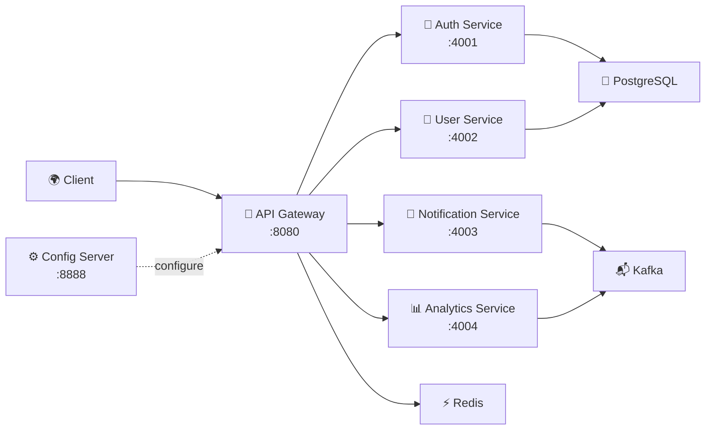
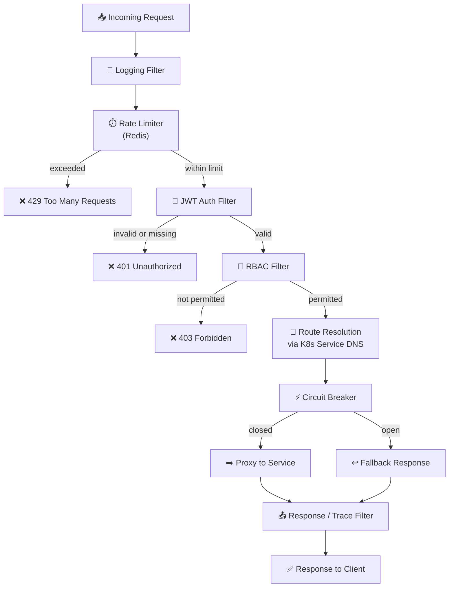
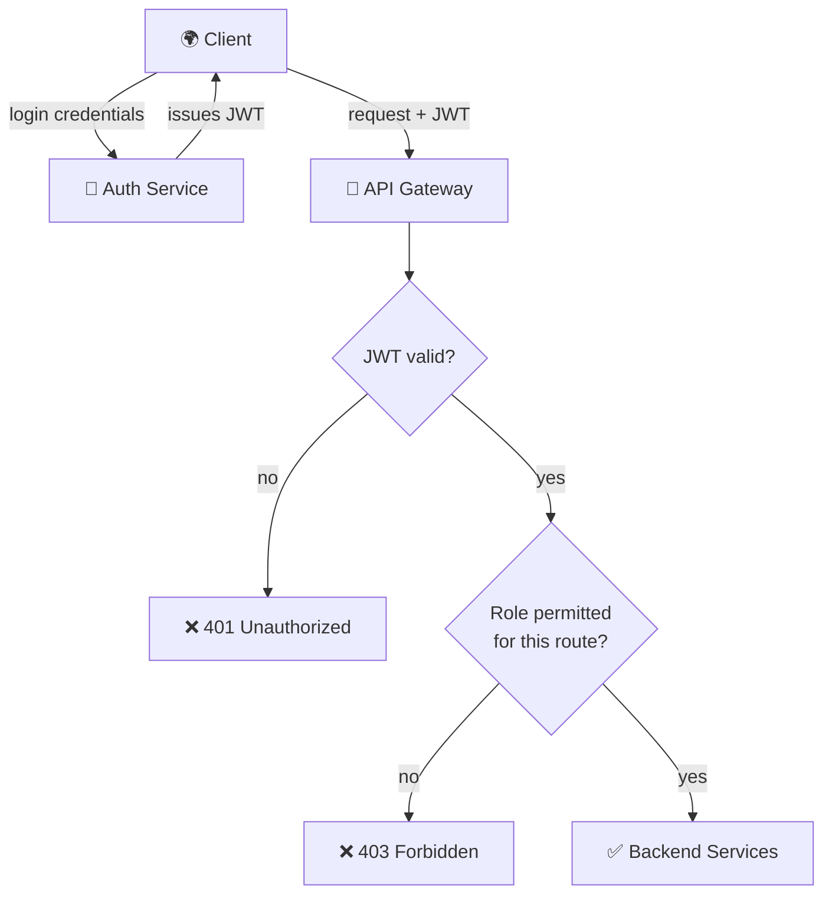

<<<<<<< HEAD
# Cloud-Native API Gateway

A starter cloud-native API gateway platform with four independently deployable services, Docker Compose support, Kubernetes manifests, Prometheus metrics, Grafana provisioning, and a k6 smoke test.

## Repository layout

```text
gateway/                 HTTP gateway and routing rules
services/                auth, user, notification, and analytics services
infrastructure/docker/   local development stack
infrastructure/kubernetes/ Kubernetes manifests
infrastructure/prometheus/ Prometheus configuration
infrastructure/grafana/  Grafana provisioning
load-testing/            k6 scenarios
scripts/                 local helper scripts
docs/                    architecture, API, learning notes, and diagrams
```
# 🚪 Cloud-Native API Gateway Platform

A production-style API Gateway built with Spring Cloud Gateway — JWT auth & RBAC, Redis-backed rate limiting and caching, Kubernetes-native service discovery, Resilience4j circuit breaking, event-driven messaging with Kafka, and full observability with Prometheus, Grafana, and OpenTelemetry/Jaeger. Containerized with Docker and deployed on Kubernetes.

[](https://github.com/<your-username>/<your-repo>/actions)
[](https://openjdk.org/)
[](https://spring.io/projects/spring-boot)
[](LICENSE)

---

## Overview

This gateway sits in front of a set of backend microservices (Auth, User, Notification, Analytics) and acts as the single entry point for all client traffic. It handles authentication, authorization, rate limiting, and routing in one place instead of duplicating that logic across every service, discovers services dynamically instead of hardcoding addresses, and fails gracefully when a downstream service is unhealthy.

## Architecture



**What happens inside the gateway on every request:**



**Auth flow:**



> 📖 **This is a slice of it.** Request flow, configuration, resilience (circuit breaking), Kubernetes cluster layout & service discovery, and full observability are all diagrammed in [`docs/ARCHITECTURE.md`](docs/ARCHITECTURE.md).

## 🚧 Project Status

- [ ] Phase 0 — Requirements, HLD, LLD
- [ ] Phase 1 — Gateway, Routing, JWT, RBAC
- [ ] Phase 2 — Redis, Rate Limiting, Caching
- [ ] Phase 3 — Service Discovery, Config Server, Microservices
- [ ] Phase 4 — Observability
- [ ] Phase 5 — Docker & Kubernetes
- [ ] Phase 6 — CI/CD, Load Testing, Documentation

## Features

- JWT-based authentication and role-based access control (RBAC)
- Dynamic request routing via Spring Cloud Gateway
- Redis-backed rate limiting and response caching
- Kubernetes-native service discovery and centralized configuration via Spring Cloud Config
- Circuit breaking and fallback handling via Resilience4j
- Event-driven notifications and analytics via Kafka
- Metrics (Prometheus/Grafana) and distributed tracing (OpenTelemetry/Jaeger)
- Containerized with Docker, deployed to Kubernetes with HPA
- CI/CD via GitHub Actions with Testcontainers-backed integration tests

## Tech Stack

| Layer | Technologies |
|---|---|
| Language & Framework | Java 21, Spring Boot |
| Gateway | Spring Cloud Gateway |
| Security | Spring Security, JWT |
| Data & Caching | PostgreSQL, Redis |
| Service Discovery & Config | Kubernetes-native (Services/DNS), Spring Cloud Config |
| Resilience | Resilience4j |
| Messaging | Kafka |
| Observability | Prometheus, Grafana, OpenTelemetry, Jaeger |
| Containers & Orchestration | Docker, Kubernetes |
| CI/CD | GitHub Actions, Testcontainers |

## Getting Started

### Prerequisites
- Java 21+
- Docker & Docker Compose
- Maven or Gradle

### Running Locally
```bash
git clone https://github.com/<your-username>/<your-repo>.git
cd <your-repo>
docker-compose up
```

The gateway will be available at `http://localhost:8080`.

## Project Structure

```
.
├── api-gateway/            # Spring Cloud Gateway
├── auth-service/
├── user-service/
├── notification-service/
├── analytics-service/
├── docs/
│   ├── ARCHITECTURE.md
│   ├── HLD.md
│   ├── LLD.md
│   └── decisions/           # one file per major engineering decision
├── k8s/                      # Kubernetes manifests / Helm chart
├── docker-compose.yml
└── .github/workflows/        # CI/CD pipelines
```

## Documentation

- [`docs/ARCHITECTURE.md`](docs/architecture) — full system architecture — low-level design — high-level design  


## License

MIT — see [LICENSE](LICENSE).

## Run locally

Requirements: Node.js 20+, Docker Desktop, and optionally k6.

```bash
docker compose -f infrastructure/docker/docker-compose.yml up --build
```

The gateway is then available at `http://localhost:8080`.

Useful endpoints:

- `GET /healthz` — gateway health
- `GET /readyz` — gateway readiness
- `GET /metrics` — Prometheus metrics
- `GET /api/auth/healthz`
- `GET /api/users/healthz`
- `GET /api/notifications/healthz`
- `GET /api/analytics/healthz`

For local development without Docker, start each service with `npm start` from its directory and then start the gateway.

## Kubernetes

```bash
kubectl apply -f infrastructure/kubernetes/namespace.yaml
kubectl apply -f infrastructure/kubernetes/
```

The manifests use the `cloud-gateway` namespace and expose the gateway through a `LoadBalancer` service.

## Design notes

The gateway is intentionally dependency-free and uses the Node.js `fetch` API for routing. Each service owns its own port and health endpoint. See [docs/architecture/README.md](docs/architecture/README.md) for the request flow and [docs/api/README.md](docs/api/README.md) for the route contract.
=======
# cloud-native-api-gateway
A scalable cloud-native API Gateway platform featuring microservices, Kubernetes orchestration, observability, event-driven architecture, and AI-powered traffic insights.
>>>>>>> 3dcceb19b109563d7cc3b454df085158b4b986ae
