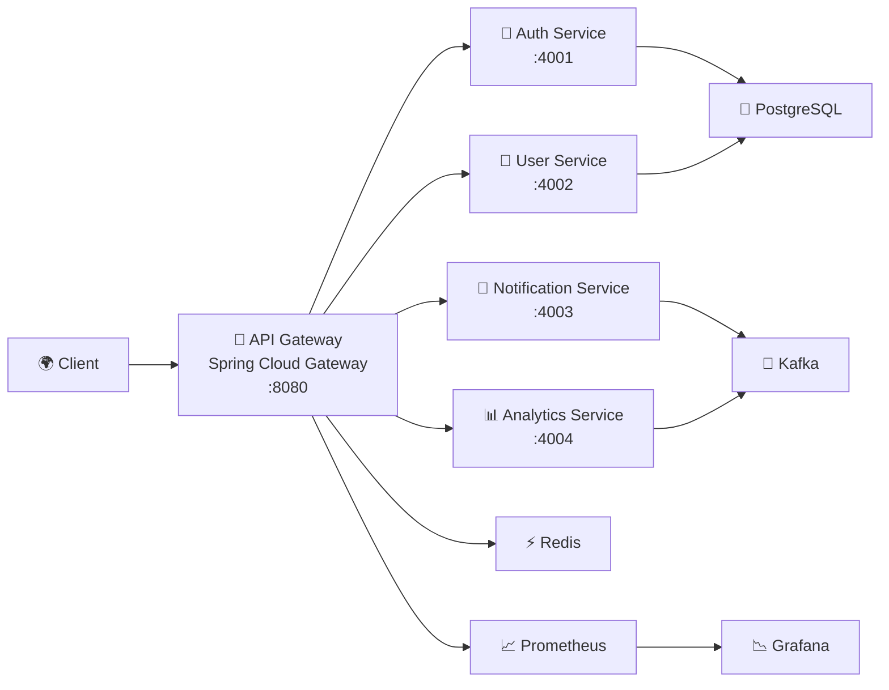
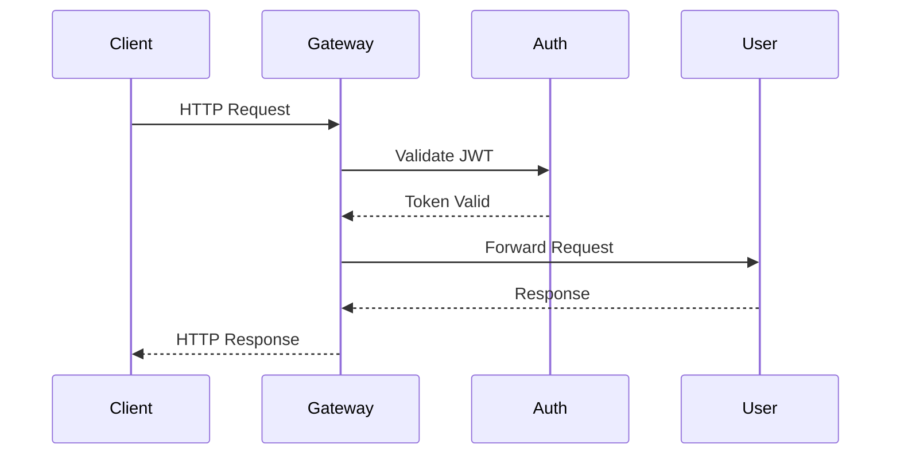
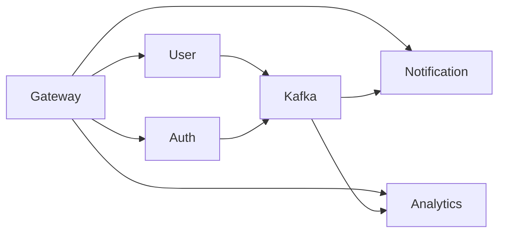
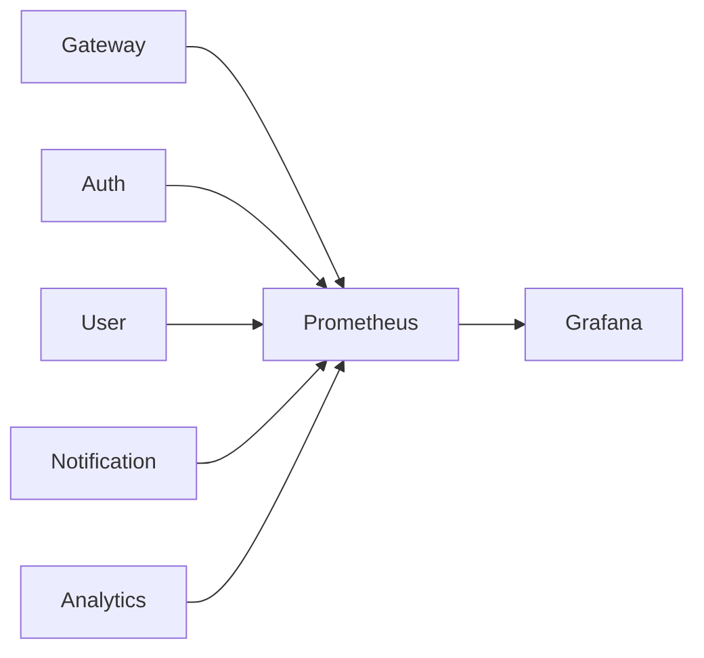

# 🏗️ Architecture

This document describes the architecture of the Cloud Native API Gateway Platform, including request routing, service communication, infrastructure, deployment, observability, and security.

---

# 1. High-Level System Architecture



### Explanation

The API Gateway acts as the single entry point for all client requests. It performs authentication, request routing, rate limiting, and forwards requests to the appropriate backend microservice. Services communicate asynchronously through Kafka, persist data in PostgreSQL, use Redis for caching, and expose metrics collected by Prometheus and visualized through Grafana.

---

# 2. Request Flow



### Explanation

Every incoming request first reaches the API Gateway. Authentication is verified before routing the request to the destination service. The gateway never exposes internal services directly to external clients.

---

# 3. Service Communication



### Explanation

The gateway communicates synchronously with backend services using REST. Services publish domain events to Kafka, enabling asynchronous communication between independent microservices.

---

# 4. Infrastructure Architecture

```mermaid
flowchart TB

Internet

↓

API Gateway

↓

Redis

↓

Microservices

↓

PostgreSQL

Microservices --> Prometheus

Prometheus --> Grafana
```

### Explanation

Redis reduces latency by caching frequently accessed data. PostgreSQL serves as the primary relational database. Prometheus continuously scrapes metrics from services, while Grafana provides operational dashboards.

---

# 5. Deployment Architecture

```mermaid
flowchart TB

Developer

↓

GitHub

↓

GitHub Actions

↓

Docker Images

↓

Kubernetes Cluster

↓

API Gateway Pods

↓

Microservice Pods
```

### Explanation

Every service is containerized using Docker and deployed independently to Kubernetes. This enables rolling updates, self-healing, and horizontal scaling.

---

# 6. Observability Architecture



### Explanation

Each service exports runtime metrics through Spring Boot Actuator. Prometheus collects these metrics and Grafana visualizes system health, request latency, throughput, and JVM statistics.

---

# 7. Security Architecture

```mermaid
flowchart LR

Client

↓

JWT Authentication

↓

API Gateway

↓

Authorization

↓

Backend Services
```

### Explanation

JWT-based authentication is enforced at the API Gateway before forwarding requests. Unauthorized traffic never reaches backend services.
