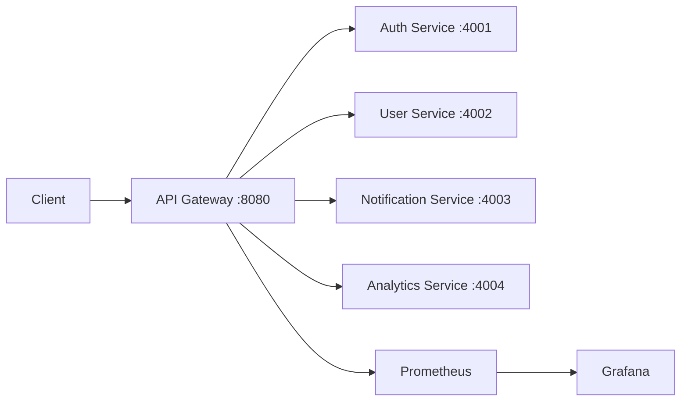

# Architecture

## Request flow

1. A client sends an HTTP request to the gateway.
2. The gateway chooses a service from the URL prefix.
3. The selected service receives the request with the original method and body.
4. The gateway returns the upstream response and records a basic request metric.
5. Prometheus scrapes gateway metrics; Grafana reads from Prometheus.

Each service has an independent port, Docker image, Kubernetes Deployment, and Kubernetes Service.
