# 🏗️ Architecture

This document describes the architecture of the Cloud Native API Gateway Platform, including request routing, service communication, service discovery, resilience, gateway internals, infrastructure, deployment, observability, and security.

---

# 1. High-Level System Architecture

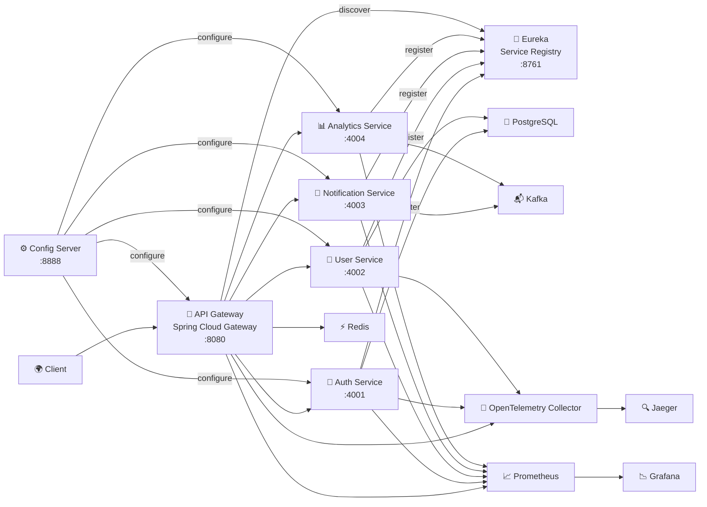

### Explanation
The API Gateway is the single entry point for all client requests, handling authentication, request routing, and rate limiting before forwarding to the right backend microservice. Every service registers itself with **Eureka** on startup and pulls its configuration from the **Config Server** instead of hardcoding either — this is what lets the gateway route to a brand-new service with zero code changes. Services persist relational data in PostgreSQL, use Redis for gateway-level caching and rate limiting, publish domain events to Kafka for async processing, and export metrics (Prometheus/Grafana) and traces (OpenTelemetry Collector → Jaeger).

---

# 2. Request Flow

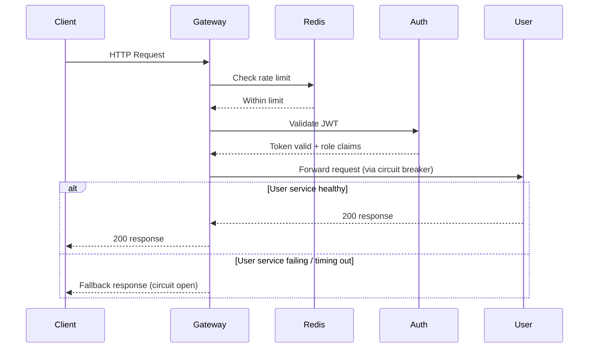

### Explanation
Every incoming request hits the gateway first. It checks the Redis-backed rate limiter, validates the JWT (rejecting missing/invalid/expired tokens), and only then forwards the request — wrapped in a Resilience4j circuit breaker — to the destination service. If the downstream service is healthy, the response flows straight back; if it's failing repeatedly, the breaker trips and the gateway returns a fallback instead of piling up failures. Internal services are never exposed directly to clients.

---

# 3. Service Communication

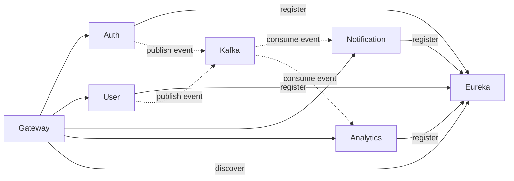

### Explanation
Gateway → service calls (solid arrows) are synchronous REST, with the target address resolved through Eureka. Auth and User publish domain events to Kafka asynchronously (dotted arrows); Notification and Analytics consume those events independently, without the publishing service knowing or caring who's listening.

---

# 4. Service Discovery & Configuration

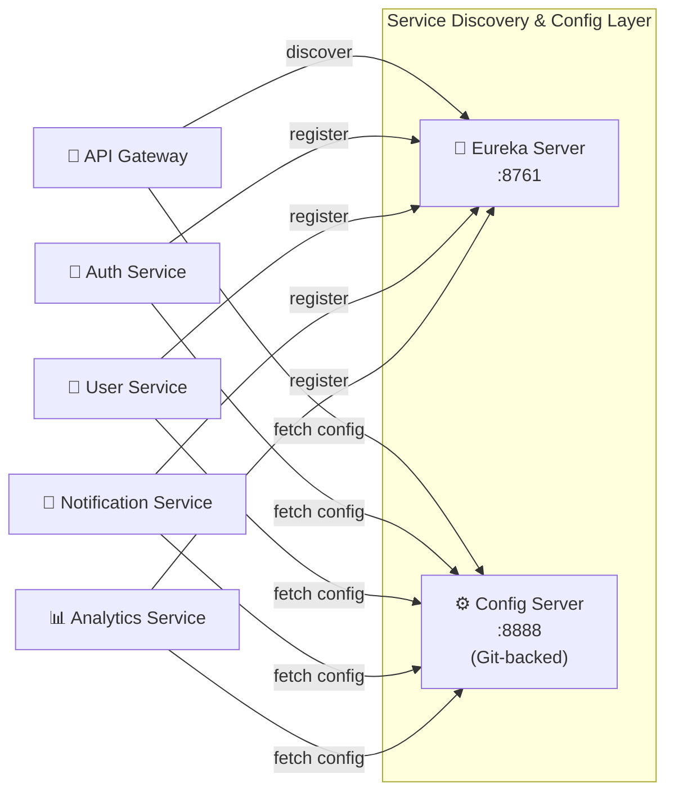

### Explanation
This is the piece that lets the system grow without touching the gateway's code. Every service announces itself to Eureka on startup ("I'm alive, here's my address"), and the gateway asks Eureka where to send traffic instead of hardcoding IPs. The Config Server centralizes properties for every service in one Git-backed source of truth, instead of duplicating config files across services.

---

# 5. Resilience Architecture

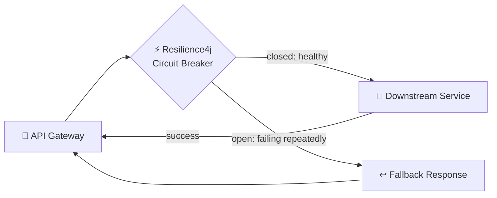

### Explanation
Every downstream call from the gateway is wrapped in a circuit breaker. While the service is healthy, the circuit stays closed and requests pass through normally. If failures cross a threshold, the circuit "opens" and the gateway short-circuits to a fallback response instead of continuing to hammer a struggling service — protecting the rest of the system from a single service's failure cascading outward.

---

# 6. API Gateway Internal Pipeline

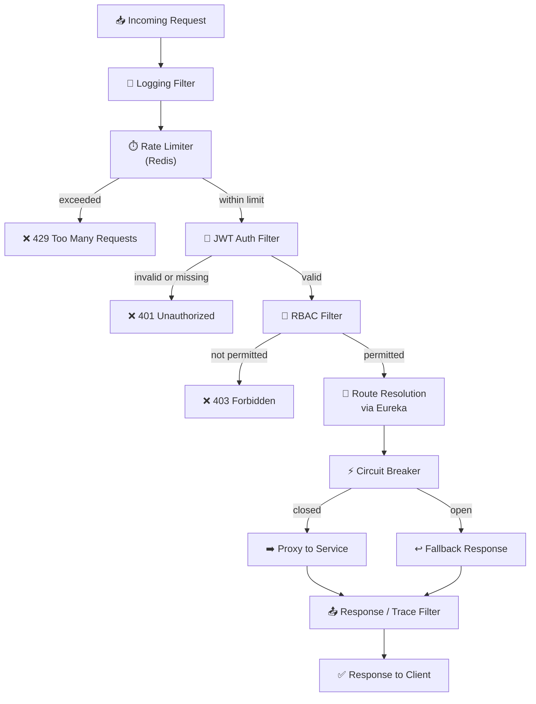

### Explanation
This is what happens inside the gateway for a single request. Spring Cloud Gateway applies its filters in order: logging first, then the Redis-backed rate limiter, then JWT validation, then RBAC. Only a request that clears all four reaches route resolution (via Eureka) and gets proxied through the circuit breaker to the target service. On the way out, a response filter attaches trace context before the response reaches the client — this is the single place where auth, rate limiting, and resilience logic live, instead of being duplicated in every downstream service.

---

# 7. Kubernetes Architecture

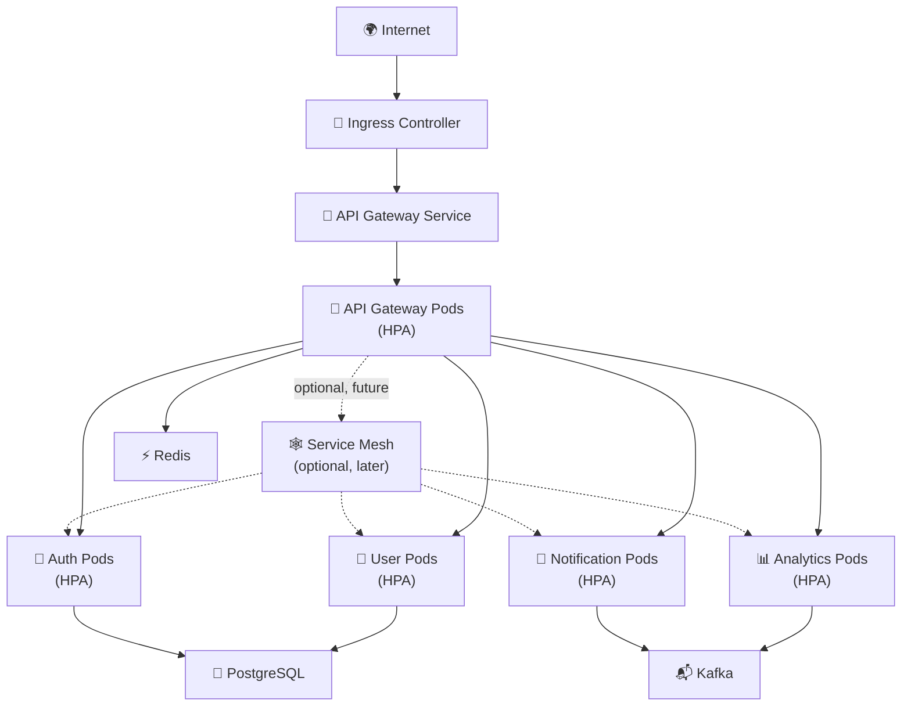

### Explanation
Traffic enters the cluster through an Ingress Controller, which routes to the API Gateway Service — a stable endpoint in front of however many Gateway pods the Horizontal Pod Autoscaler currently has running. The gateway talks to each backend service's pods directly today; a service mesh is shown as an optional later addition once the pod-to-pod traffic pattern gets complex enough to need mTLS, retries, or traffic shaping at the infrastructure layer instead of in application code. Redis, PostgreSQL, and Kafka sit alongside the service pods as the cluster's stateful dependencies.

---

# 8. Infrastructure Architecture

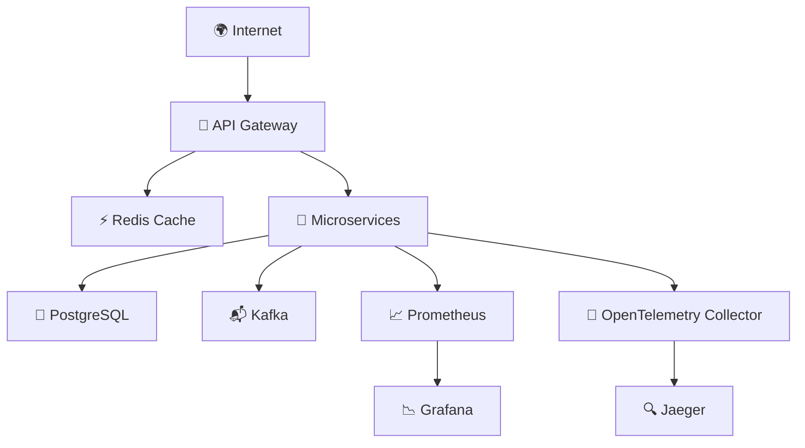

### Explanation
Redis sits close to the gateway to reduce latency on rate-limit checks and cached responses. PostgreSQL is the system of record for anything needing strong consistency. Prometheus continuously scrapes metrics from every service and Grafana turns those into dashboards, while each service's OpenTelemetry instrumentation sends traces to the Collector, which forwards them to Jaeger for visualization.

---

# 9. Deployment Architecture

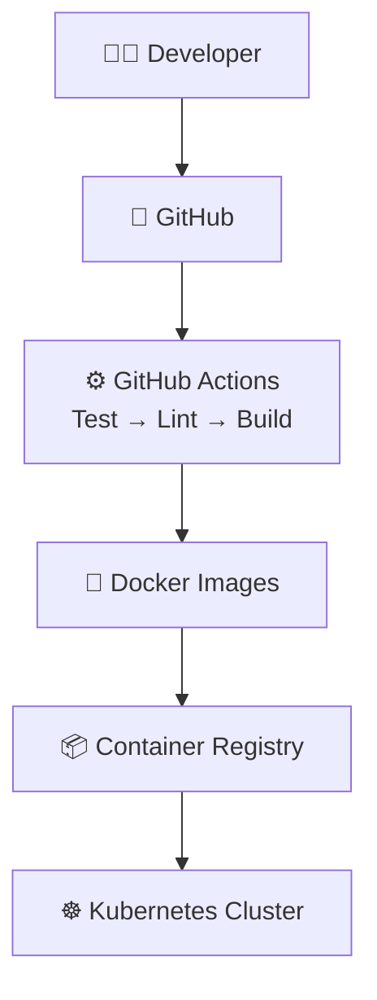

### Explanation
Every push runs the GitHub Actions pipeline: automated tests (Testcontainers-backed against real Postgres/Redis), lint, then a Docker image build. Images are pushed to a registry and deployed to the Kubernetes cluster — see the Kubernetes Architecture diagram above for how the cluster itself is organized once the images land there.

---

# 10. Observability Architecture

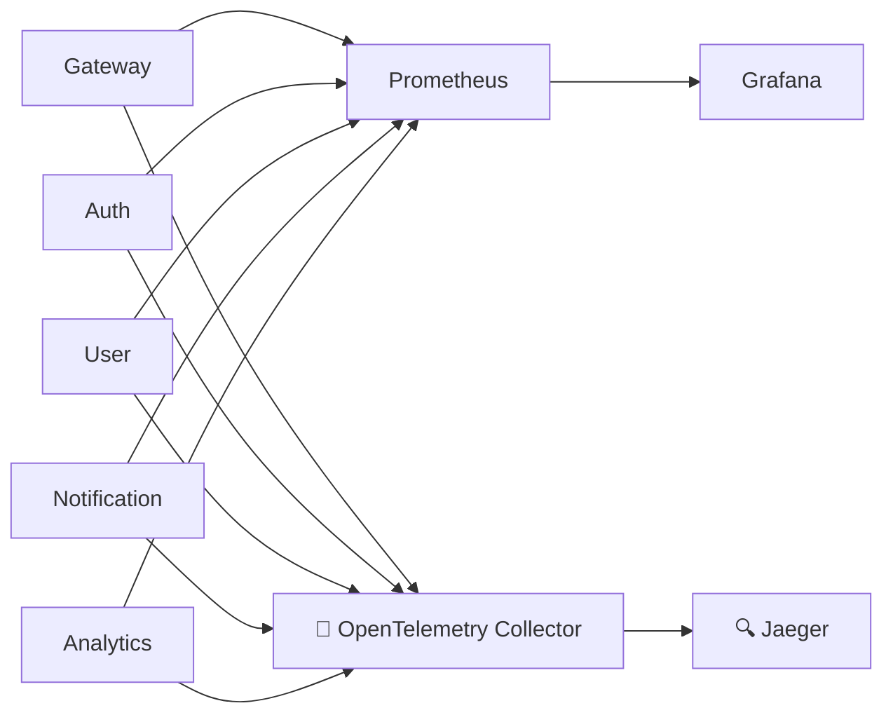

### Explanation
Each service exports runtime metrics via Spring Boot Actuator + Micrometer, scraped by Prometheus and visualized in Grafana — request latency, throughput, error rate, JVM stats. Separately, every service is instrumented with OpenTelemetry, which exports traces to the OpenTelemetry Collector; the Collector forwards them to Jaeger, so a request's full path across the gateway and multiple services can be followed as one timeline.

---

# 11. Security Architecture

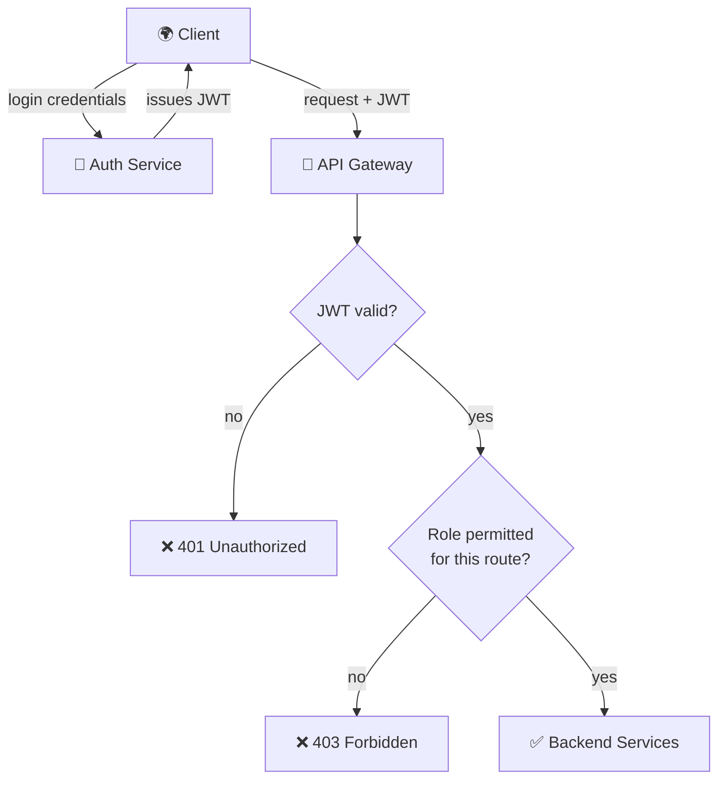

### Explanation
The client authenticates once against the Auth Service and receives a signed JWT. Every subsequent request carries that token, and the gateway validates it before anything else happens — first checking the signature/expiry, then checking whether the role encoded in the token is permitted for that specific route (RBAC). Unauthorized or under-permissioned traffic never reaches a backend service.
