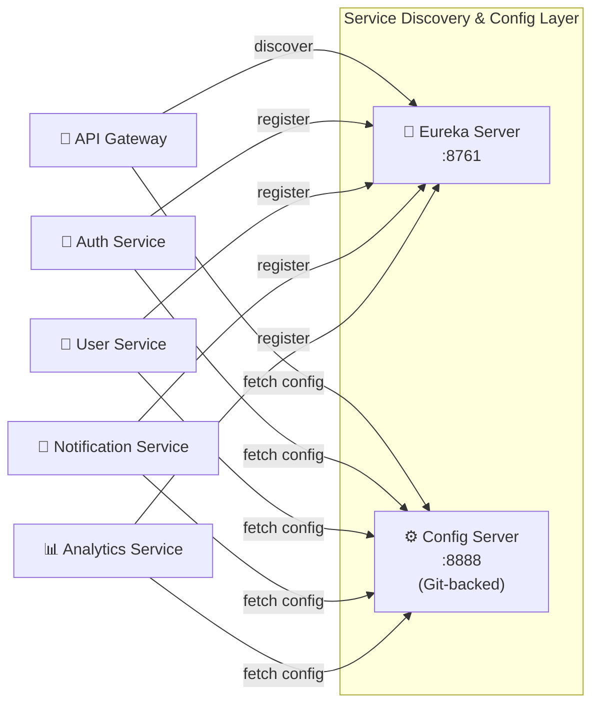
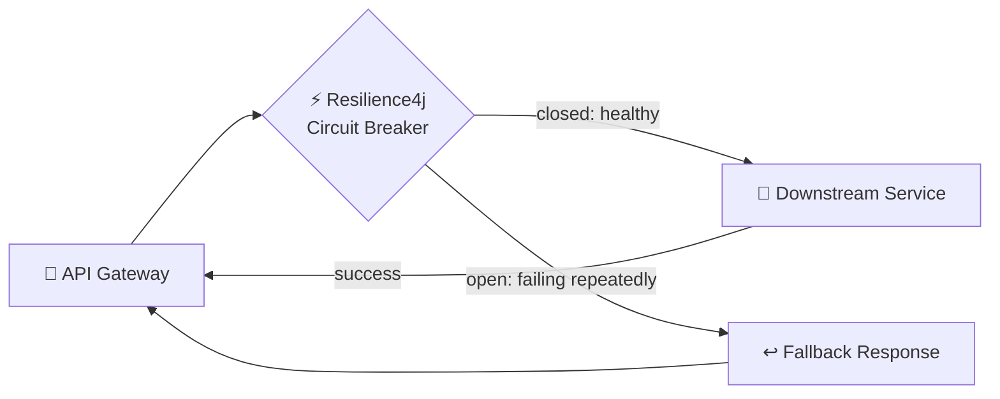
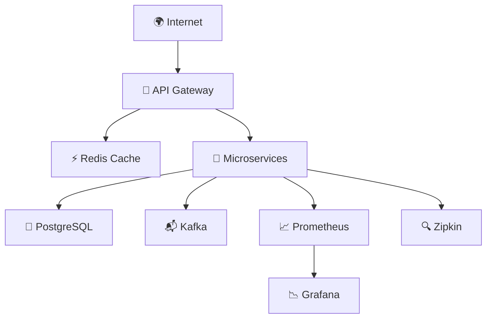
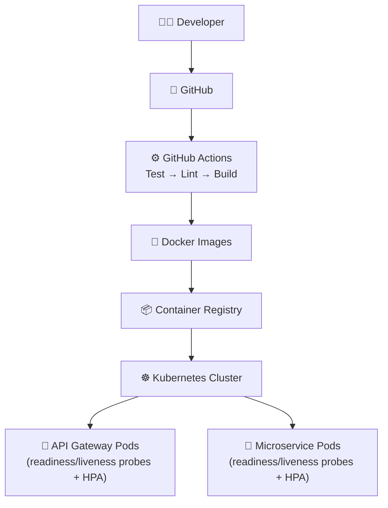
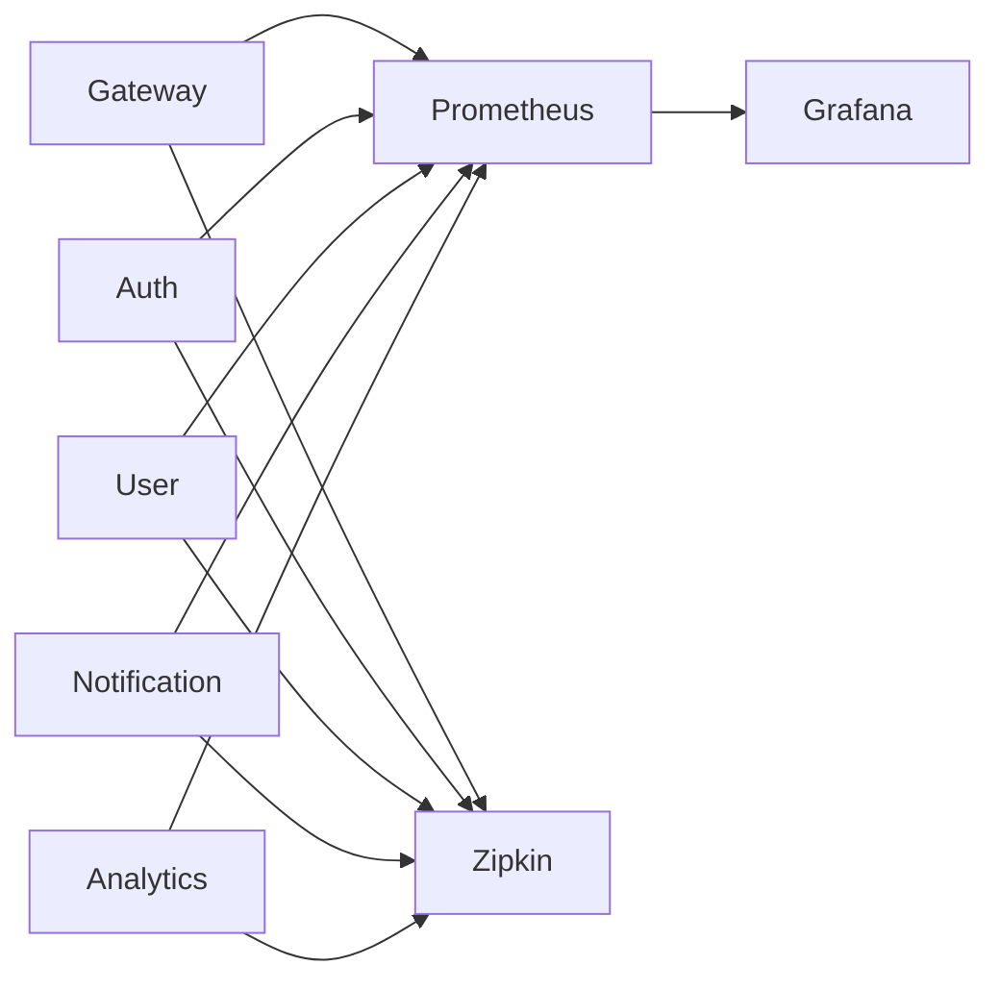
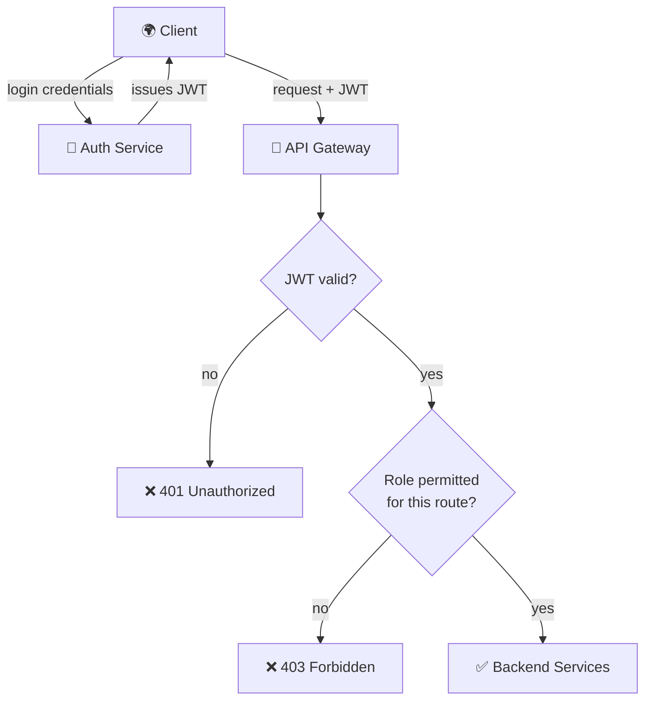
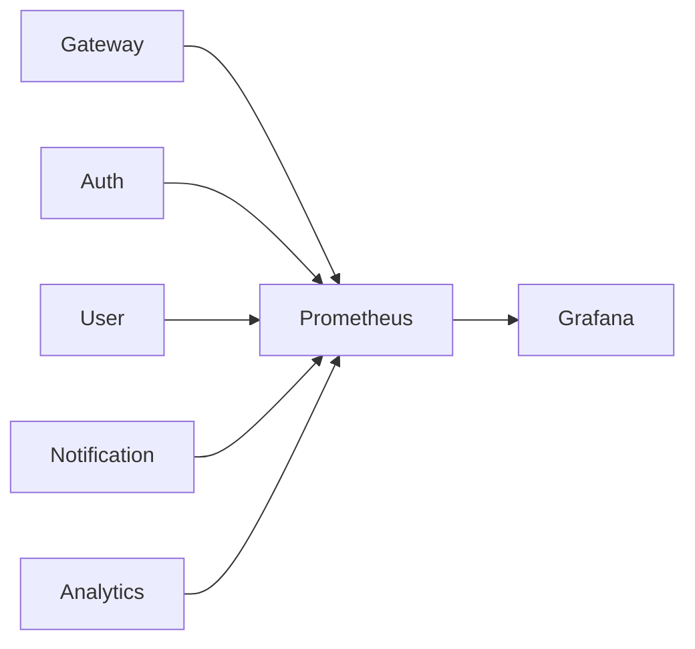

# 🏗️ Architecture

<<<<<<< HEAD
This document describes the architecture of the Cloud Native API Gateway Platform, including request routing, service communication, service discovery, resilience, infrastructure, deployment, observability, and security.
=======
This document describes the architecture of the Cloud Native API Gateway Platform, including request routing, service communication, infrastructure, deployment, observability, and security.
>>>>>>> 0a4ce4e892f583059b26984e4d3036b29b79cebb

---

# 1. High-Level System Architecture

```mermaid
flowchart LR
<<<<<<< HEAD
    Client["🌍 Client"]
    Gateway["🚪 API Gateway<br/>Spring Cloud Gateway<br/>:8080"]
    Eureka["🧭 Eureka<br/>Service Registry<br/>:8761"]
    Config["⚙️ Config Server<br/>:8888"]
    Auth["🔐 Auth Service<br/>:4001"]
    User["👤 User Service<br/>:4002"]
    Notification["📨 Notification Service<br/>:4003"]
    Analytics["📊 Analytics Service<br/>:4004"]
    Redis["⚡ Redis"]
    Postgres["🐘 PostgreSQL"]
    Kafka["📬 Kafka"]
    Prometheus["📈 Prometheus"]
    Grafana["📉 Grafana"]
    Zipkin["🔍 Zipkin"]

    Client --> Gateway
    Gateway --> Auth
    Gateway --> User
    Gateway --> Notification
    Gateway --> Analytics

    Auth -->|register| Eureka
    User -->|register| Eureka
    Notification -->|register| Eureka
    Analytics -->|register| Eureka
    Gateway -->|discover| Eureka

    Config -->|configure| Auth
    Config -->|configure| User
    Config -->|configure| Notification
    Config -->|configure| Analytics
    Config -->|configure| Gateway

    Auth --> Postgres
    User --> Postgres
    Gateway --> Redis

    Notification --> Kafka
    Analytics --> Kafka

    Gateway --> Prometheus
    Auth --> Prometheus
    User --> Prometheus
    Notification --> Prometheus
    Analytics --> Prometheus
    Prometheus --> Grafana

    Gateway --> Zipkin
    Auth --> Zipkin
    User --> Zipkin
```

### Explanation
The API Gateway is the single entry point for all client requests, handling authentication, request routing, and rate limiting before forwarding to the right backend microservice. Every service registers itself with **Eureka** on startup and pulls its configuration from the **Config Server** instead of hardcoding either — this is what lets the gateway route to a brand-new service with zero code changes. Services persist relational data in PostgreSQL, use Redis for gateway-level caching and rate limiting, publish domain events to Kafka for async processing, and export both metrics (Prometheus/Grafana) and distributed traces (Zipkin).

---

=======

Client["🌍 Client"]

Gateway["🚪 API Gateway
Spring Cloud Gateway
:8080"]

Auth["🔐 Auth Service
:4001"]

User["👤 User Service
:4002"]

Notification["📨 Notification Service
:4003"]

Analytics["📊 Analytics Service
:4004"]

Redis["⚡ Redis"]

Postgres["🐘 PostgreSQL"]

Kafka["📨 Kafka"]

Prometheus["📈 Prometheus"]

Grafana["📉 Grafana"]

Client --> Gateway

Gateway --> Auth
Gateway --> User
Gateway --> Notification
Gateway --> Analytics

Auth --> Postgres
User --> Postgres

Gateway --> Redis

Notification --> Kafka
Analytics --> Kafka

Gateway --> Prometheus

Prometheus --> Grafana
```

### Explanation

The API Gateway acts as the single entry point for all client requests. It performs authentication, request routing, rate limiting, and forwards requests to the appropriate backend microservice. Services communicate asynchronously through Kafka, persist data in PostgreSQL, use Redis for caching, and expose metrics collected by Prometheus and visualized through Grafana.

---

>>>>>>> 0a4ce4e892f583059b26984e4d3036b29b79cebb
# 2. Request Flow

```mermaid
sequenceDiagram
<<<<<<< HEAD
    participant Client
    participant Gateway
    participant Redis
    participant Auth
    participant User

    Client->>Gateway: HTTP Request
    Gateway->>Redis: Check rate limit
    Redis-->>Gateway: Within limit
    Gateway->>Auth: Validate JWT
    Auth-->>Gateway: Token valid + role claims
    Gateway->>User: Forward request (via circuit breaker)
    alt User service healthy
        User-->>Gateway: 200 response
        Gateway-->>Client: 200 response
    else User service failing / timing out
        Gateway-->>Client: Fallback response (circuit open)
    end
```

### Explanation
Every incoming request hits the gateway first. It checks the Redis-backed rate limiter, validates the JWT (rejecting missing/invalid/expired tokens), and only then forwards the request — wrapped in a Resilience4j circuit breaker — to the destination service. If the downstream service is healthy, the response flows straight back; if it's failing repeatedly, the breaker trips and the gateway returns a fallback instead of piling up failures. Internal services are never exposed directly to clients.
=======

participant Client
participant Gateway
participant Auth
participant User

Client->>Gateway: HTTP Request

Gateway->>Auth: Validate JWT

Auth-->>Gateway: Token Valid

Gateway->>User: Forward Request

User-->>Gateway: Response

Gateway-->>Client: HTTP Response
```

### Explanation

Every incoming request first reaches the API Gateway. Authentication is verified before routing the request to the destination service. The gateway never exposes internal services directly to external clients.
>>>>>>> 0a4ce4e892f583059b26984e4d3036b29b79cebb

---

# 3. Service Communication

```mermaid
flowchart LR
<<<<<<< HEAD
    Gateway --> Auth
    Gateway --> User
    Gateway --> Notification
    Gateway --> Analytics

    Auth -->|register| Eureka
    User -->|register| Eureka
    Notification -->|register| Eureka
    Analytics -->|register| Eureka
    Gateway -->|discover| Eureka

    User --> Kafka
    Auth --> Kafka
    Kafka --> Notification
    Kafka --> Analytics
```

### Explanation
The gateway talks to backend services synchronously over REST, resolving each service's address through Eureka rather than a hardcoded URL. Services publish domain events to Kafka, which lets Notification and Analytics react to things like "user created" or "auth event" asynchronously, without the publishing service knowing or caring who's listening.

---

# 4. Service Discovery & Configuration



### Explanation
This is the piece that lets the system grow without touching the gateway's code. Every service announces itself to Eureka on startup ("I'm alive, here's my address"), and the gateway asks Eureka where to send traffic instead of hardcoding IPs. The Config Server centralizes properties for every service in one Git-backed source of truth, instead of duplicating config files across services.

---

# 5. Resilience Architecture



### Explanation
Every downstream call from the gateway is wrapped in a circuit breaker. While the service is healthy, the circuit stays closed and requests pass through normally. If failures cross a threshold, the circuit "opens" and the gateway short-circuits to a fallback response instead of continuing to hammer a struggling service — protecting the rest of the system from a single service's failure cascading outward.

---

# 6. Infrastructure Architecture



### Explanation
Redis sits close to the gateway to reduce latency on rate-limit checks and cached responses. PostgreSQL is the system of record for anything needing strong consistency. Prometheus continuously scrapes metrics from every service, Grafana turns those into dashboards, and Zipkin collects distributed traces so a single request's path across services can be reconstructed.

---

# 7. Deployment Architecture



### Explanation
Every push runs the GitHub Actions pipeline: automated tests (Testcontainers-backed against real Postgres/Redis), lint, then a Docker image build. Images are pushed to a registry and deployed independently to Kubernetes, where each service's pods have readiness and liveness probes and a Horizontal Pod Autoscaler — enabling rolling updates, self-healing, and load-based scaling.

---

# 8. Observability Architecture



### Explanation
Each service exports runtime metrics via Spring Boot Actuator + Micrometer, scraped by Prometheus and visualized in Grafana — request latency, throughput, error rate, JVM stats. Separately, OpenTelemetry instrumentation exports traces to Zipkin, so when a request crosses the gateway and several services, you can follow its full path as one timeline instead of guessing which service was slow.

---

# 9. Security Architecture



### Explanation
The client authenticates once against the Auth Service and receives a signed JWT. Every subsequent request carries that token, and the gateway validates it before anything else happens — first checking the signature/expiry, then checking whether the role encoded in the token is permitted for that specific route (RBAC). Unauthorized or under-permissioned traffic never reaches a backend service.

---

# 10. Tech Stack Coverage

Cross-checked against the 14 technologies in your roadmap PDF:

| # | Technology (from your PDF) | Covered here | Where |
|---|---|---|---|
| 1 | Java | ✅ | All services |
| 2 | HTTP, REST, JSON | ✅ | Request Flow |
| 3 | Spring Boot | ✅ | All services |
| 4 | Spring Security + JWT | ✅ | Security Architecture |
| 5 | Spring Cloud Gateway | ✅ | High-Level Architecture |
| 6 | PostgreSQL | ✅ | High-Level Architecture |
| 7 | Redis | ✅ | High-Level Architecture, Request Flow |
| 8 | Docker | ✅ | Deployment Architecture |
| 9 | Spring Cloud Config + Eureka | ✅ *(added — was missing)* | Service Discovery & Configuration |
| 10 | Resilience4j | ✅ *(added — was missing)* | Resilience Architecture |
| 11 | Prometheus + Grafana | ✅ | Observability Architecture |
| 12 | OpenTelemetry / Zipkin | ✅ *(added — was missing)* | Observability Architecture |
| 13 | Kubernetes | ✅ | Deployment Architecture |
| 14 | GitHub Actions (CI/CD) | ✅ | Deployment Architecture |
| — | Kafka | ⚠️ Not in the original 14 | High-Level Architecture, Service Communication *(your own addition — fine to keep for Notification/Analytics, just wasn't part of the roadmap)* |
=======

Gateway --> Auth

Gateway --> User

Gateway --> Notification

Gateway --> Analytics

User --> Kafka

Auth --> Kafka

Kafka --> Notification

Kafka --> Analytics
```

### Explanation

The gateway communicates synchronously with backend services using REST. Services publish domain events to Kafka, enabling asynchronous communication between independent microservices.

---

# 4. Infrastructure Architecture

```mermaid
flowchart TB

Internet

↓

API Gateway

↓

Redis

↓

Microservices

↓

PostgreSQL

Microservices --> Prometheus

Prometheus --> Grafana
```

### Explanation

Redis reduces latency by caching frequently accessed data. PostgreSQL serves as the primary relational database. Prometheus continuously scrapes metrics from services, while Grafana provides operational dashboards.

---

# 5. Deployment Architecture

```mermaid
flowchart TB

Developer

↓

GitHub

↓

GitHub Actions

↓

Docker Images

↓

Kubernetes Cluster

↓

API Gateway Pods

↓

Microservice Pods
```

### Explanation

Every service is containerized using Docker and deployed independently to Kubernetes. This enables rolling updates, self-healing, and horizontal scaling.

---

# 6. Observability Architecture



### Explanation

Each service exports runtime metrics through Spring Boot Actuator. Prometheus collects these metrics and Grafana visualizes system health, request latency, throughput, and JVM statistics.

---

# 7. Security Architecture

```mermaid
flowchart LR

Client

↓

JWT Authentication

↓

API Gateway

↓

Authorization

↓

Backend Services
```

### Explanation

JWT-based authentication is enforced at the API Gateway before forwarding requests. Unauthorized traffic never reaches backend services.
>>>>>>> 0a4ce4e892f583059b26984e4d3036b29b79cebb
